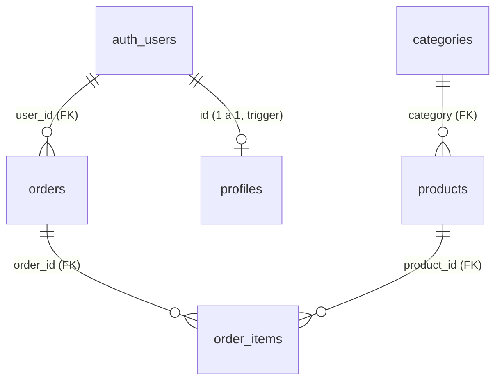

# Dimonca · Base de datos (Supabase)

> Documentación viva del backend de Dimonca. **Toda** migración SQL que se ejecute contra Supabase debe quedar registrada aquí (sección [Historial de migraciones](#historial-de-migraciones)), junto con su contenido, decisiones de diseño y convenciones.

---

## 1. Información general

| Dato | Valor |
|---|---|
| Proyecto Supabase | `dimonca-products` |
| Project ref | `lllfiozaabjevitbpfch` |
| Región | `us-east-2` |
| Motor | PostgreSQL 17 |
| Estado | `ACTIVE_HEALTHY` |
| MCP | Servidor `supabase` conectado a opencode (ya autenticado por el usuario) |
| Esquema de trabajo | `public` |

**Convenciones globales**

- Nombres de tablas/columnas en `snake_case`; los ids de catálogo son **slugs de texto** (`galleta-roche`) para que coincidan 1:1 con los ids del front (`src/types/products.ts`).
- **Precios en enteros COP sin decimales** (`11000` = $11.000). Nunca usar `float` para dinero.
- Todas las tablas tienen `created_at` / `updated_at` (`timestamptz`, UTC).
- **RLS activado en todas las tablas** desde el día 1. Sin políticas de escritura para clientes en el catálogo: los productos se gestionan desde el dashboard o con la `service_role` key.
- "Borrar" un producto = poner `available = false` (soft delete). El `DELETE` real está bloqueado por las FK de `order_items`.

---

## 2. Cómo aplicar las migraciones

Los scripts viven en `supabase/migrations/` y se ejecutan **en orden lexicográfico**:

1. Copiar el contenido de cada archivo en **Supabase Dashboard → SQL Editor → New query** y ejecutarlo con **Run**.
2. Orden obligatorio:
   1. `20260911000001_init_catalog.sql`
   2. `20260911000002_auth_orders.sql`
   3. `20260911000003_seed_mock_data.sql`
3. Verificar en **Table Editor** que las 5 tablas existan y que el seed insertó 5 categorías + 12 productos.
4. Alternativa: pedirme en opencode que las aplique yo mismo vía MCP (`supabase_apply_migration`) — así quedan registradas también en la tabla `supabase_migrations`.

> Si algún día se instala Supabase CLI, estos archivos ya cumplen la convención `<timestamp>_<nombre>.sql` de `supabase db push`.

---

## 3. Modelo de datos (ER)



- `auth_users` = `auth.users`, la tabla interna de **Supabase Auth** (no vive en `public` y no se modifica manualmente).
- Los **carritos** son una tabla futura (ver [Roadmap](#17-roadmap-tablas-futuras-no-ejecutar-aún)); hoy el carrito vive en `localStorage` (`src/stores/cartStore.ts`).

---

## 4. Tabla `categories`

Categorías del menú. 5 filas fijas (seed): `galletas`, `cuchareables`, `brownies`, `tortas`, `otros`.

| Columna | Tipo | Nulo | Descripción |
|---|---|---|---|
| `id` | `text` PK | no | Slug: `galletas`, `cuchareables`, ... |
| `label` | `text` | no | Texto visible: "Galletas", "Otros productos" |
| `description` | `text` | no | Descripción de la categoría (tabs del menú) |
| `sort_order` | `integer` | no | Orden de aparición en tabs/filtros |
| `created_at` / `updated_at` | `timestamptz` | no | Auditoría (`updated_at` automático por trigger) |

Constraints: `categories_id_format` — el id debe ser `^[a-z0-9_-]+$`.

---

## 5. Tabla `products`

Catálogo de productos. **Espejo exacto de la interfaz `Product` de `src/types/products.ts`** (ver [Mapeo DB ↔ TypeScript](#16-mapeo-db--typescript)).

### Tipos de producto

- `single` → producto **normal** (una galleta, un crookie, etc.).
- `custom_box` → **caja para armar** ("Arma tu caja x3 / x9 / x3+Helado"). Son los combos/cajas especiales del diseño: siempre con `variant = 'premium'` y `category_label = 'Combos'`, y con `box_config` **obligatorio**.
- En `single` el campo `box_config` está **prohibido** (constraint `products_box_config_presence`).

### Columnas

| Columna | Tipo | Nulo | Descripción / equivalente TS |
|---|---|---|---|
| `id` | `text` PK | no | `id` — slug (`galleta-roche`) |
| `name` | `text` | no | `name` |
| `product_type` | `text` | no | `productType` — `'single' \| 'custom_box'` |
| `category` | `text` FK → `categories.id` | no | `category` — `ON DELETE RESTRICT` (no se puede borrar una categoría con productos) |
| `category_label` | `text` | no | `categoryLabel` — texto mostrado. **Denormalizada a propósito**: los combos muestran "Combos" aunque su `category` sea `galletas` |
| `price` | `integer` | no | `price` — COP. `CHECK (price > 0)` |
| `price_formatted` | `text` **GENERADA** | — | `priceFormatted` — se calcula sola: `'$11.000'` |
| `extra_price` | `integer` | sí | `extraPrice` — recargo opcional (Habibi +2000, Nutella +1000) |
| `extra_price_formatted` | `text` **GENERADA** | — | `extraPriceFormatted` — `'(+ $2.000)'` o `NULL` |
| `short_description` | `text` | no | `shortDescription` |
| `full_description` | `text` | no | `fullDescription` |
| `ingredients` | `text[]` | sí | `ingredients` |
| `allergens` | `text[]` | sí | `allergens` |
| `image_src` | `text` | no | `imageSrc` — ruta dentro del bucket `product-images` |
| `image_hover_src` | `text` | sí | `imageHoverSrc` |
| `gallery` | `text[]` | sí | `gallery` — **fotos terciarias, máx. 3** (`CHECK cardinality BETWEEN 1 AND 3`). Opcional; disponible para `single` y `custom_box`. Se muestran como miniaturas |
| `badge` | `text` | sí | `badge` |
| `badge_color` | `text` | sí | `badgeColor` |
| `rating` | `numeric(2,1)` | sí | `rating` — `CHECK 0..5` |
| `available` | `boolean` | no | `available` — soft delete / visibilidad |
| `accent_color` | `text` | sí | `accentColor` |
| `variant` | `text` | sí | `variant` — `'standard' \| 'premium'` |
| `sort_order` | `integer` | no | **Nuevo** — orden de visualización en la grilla (en el mock era el orden del array) |
| `box_config` | `jsonb` | sí | `boxConfig` — solo `custom_box`. Estructura validada por constraint |
| `created_at` / `updated_at` | `timestamptz` | no | Auditoría |

### Estructura de `box_config` (jsonb)

Espejo de `BoxConfiguration` en `src/types/products.ts`:

```json
{
  "capacity": 3,                    // obligatorio, entero > 0
  "allowDuplicates": true,          // boolean o ausente
  "includesIceCream": false,        // boolean o ausente
  "availableItemCategory": "galletas" // obligatorio (categoría de los ítems armables)
}
```

### Función auxiliar `fmt_money_cop(integer) → text`

`IMMUTABLE`. Inserta puntos de miles: `11000 → '$11.000'`, `39000 → '$39.000'`. Alimenta las dos columnas generadas. Esto además **normaliza** las inconsistencias del mock (`'$ 39.000'` → `'$39.000'`).

---

## 6. Tabla `profiles`

Perfil público de cada usuario. **Se crea automáticamente** cuando alguien se registra (email/contraseña, Google o Apple) mediante el trigger `on_auth_user_created` → función `handle_new_user()` (`SECURITY DEFINER`), que extrae `full_name`/`phone` de los metadatos del proveedor.

| Columna | Tipo | Descripción |
|---|---|---|
| `id` | `uuid` PK, FK → `auth.users(id) ON DELETE CASCADE` | Mismo id que el usuario de Auth |
| `email` | `text` | Copia de `auth.users.email` (para analíticas sin tocar el esquema `auth`) |
| `full_name` | `text` | Nombre (de Google/Apple o del registro por email) |
| `phone` | `text` | Teléfono (para pedidos con entrega) |
| `created_at` / `updated_at` | `timestamptz` | Auditoría |

---

## 7. Tabla `orders`

Historial de transacciones/pedidos. **Un pedido siempre pertenece a un usuario autenticado** (la tienda se navega sin sesión; se exige sesión al pulsar "Comprar" en el carrito).

| Columna | Tipo | Descripción |
|---|---|---|
| `id` | `uuid` PK | Identificador interno |
| `order_number` | `bigint` IDENTITY (desde 1001) | Número visible para el cliente: 1001, 1002... |
| `user_id` | `uuid` FK → `auth.users(id) ON DELETE CASCADE` | Dueño del pedido |
| `status` | `text` | `pending` → `confirmed` → `preparing` → `delivered`, o `cancelled` |
| `customer_name` | `text` | Snapshot del nombre al momento de comprar |
| `customer_email` | `text` | Snapshot del email |
| `customer_phone` | `text` | Snapshot del teléfono |
| `delivery_address` | `text` | Opcional — si es NULL se asume recoger en tienda |
| `notes` | `text` | Notas del cliente (dedicatorias, preferencias) |
| `subtotal` | `integer` | Suma de `line_total` de los ítems (COP) |
| `delivery_fee` | `integer` | Costo de envío (COP, 0 por ahora) |
| `total` | `integer` | `CHECK (total = subtotal + delivery_fee)` |
| `payment_method` | `text` | Se definirá con la fase de pagos |
| `created_at` / `updated_at` | `timestamptz` | `created_at` = fecha de compra (base de las analíticas) |

**Ciclo de vida de `status`:** lo gestiona el negocio desde el dashboard (los clientes no pueden modificar pedidos por RLS).

```
pending ──► confirmed ──► preparing ──► delivered
   └──────────────► cancelled ◄─────────────┘
```

---

## 8. Tabla `order_items`

Líneas de cada pedido. **Guarda snapshot** del producto (`product_name`, `product_type`, `unit_price`) para que el historial y las analíticas sobrevivan a cambios de precio o desactivaciones.

| Columna | Tipo | Descripción |
|---|---|---|
| `id` | `uuid` PK | |
| `order_id` | `uuid` FK → `orders(id) ON DELETE CASCADE` | Si se borra un pedido, se borran sus ítems |
| `product_id` | `text` FK → `products(id) ON DELETE RESTRICT` | Protege el historial: un producto con ventas **no se puede borrar**, solo desactivar |
| `product_name` | `text` | Snapshot |
| `product_type` | `text` | Snapshot: `'single' \| 'custom_box'` |
| `unit_price` | `integer` | Precio COP al momento de la compra |
| `quantity` | `integer` | `CHECK (quantity > 0)` |
| `line_total` | `integer` **GENERADA** | `unit_price * quantity`, calculada sola |
| `box_contents` | `jsonb` | Solo `custom_box`: array `{productId, name, imageSrc, quantity}` (espejo de `SelectedBoxItem`) |
| `created_at` | `timestamptz` | |

---

## 9. Seguridad (RLS) — resumen

| Tabla | anon (sin sesión) | authenticated (con sesión) | Escritura de negocio |
|---|---|---|---|
| `categories` | SELECT | SELECT | Dashboard / `service_role` |
| `products` | SELECT | SELECT | Dashboard / `service_role` |
| `profiles` | — | SELECT, UPDATE (solo la propia) | Trigger automático al registrarse |
| `orders` | — | SELECT, INSERT (solo propios, `user_id = auth.uid()`) | UPDATE/DELETE solo dashboard / `service_role` |
| `order_items` | — | SELECT, INSERT (solo ítems de pedidos propios) | Dashboard / `service_role` |

Notas:

- El INSERT de `order_items` valida con subconsulta que el pedido padre pertenece al usuario → nadie puede "colarse" en el pedido de otro.
- El catálogo se lee **sin sesión** (coherente con la regla del negocio: ver la página es libre, comprar exige estar autenticado).
- Tras aplicar las migraciones conviene revisar **Database → Advisors** en el dashboard (debe quedar sin avisos de RLS).

---

## 10. Autenticación (Supabase Auth)

Se habilita desde el dashboard (**Authentication → Providers**); no requiere SQL:

1. **Email + contraseña** — provider "Email" (activo por defecto).
2. **Google** — OAuth: crear credenciales en Google Cloud Console y pegar client ID/secret.
3. **Apple** — Services ID + claves de Sign in with Apple.

Flujo de compra definido:

- Navegar catálogo y armar carrito: **sin sesión** (carrito en `localStorage` hoy).
- Botón "Comprar" en el carrito: si no hay sesión → login/registro → continuar checkout.
- Al registrarse por cualquier proveedor, el trigger crea su `profiles` automáticamente.
- El checkout inserta `orders` + `order_items` en una sola transacción (RLS valida propiedad).

---

## 11. Storage (imágenes)

Bucket **`product-images`** (público, creado por la migración 3).

- URL pública de cada archivo: `https://lllfiozaabjevitbpfch.supabase.co/storage/v1/object/public/product-images/<ruta>`
- La BD guarda **rutas relativas** (portables), no URLs absolutas. El front las resuelve con `SUPABASE_URL` + la ruta.
- Convención de carpetas dentro del bucket:

| Carpeta | Contenido | Ejemplo |
|---|---|---|
| `single/` | PNG principal de cada producto single | `single/galleta-roche.png` |
| `boxes/` | PNG de las cajas/combos | `boxes/arma-tu-caja-x3.png` |
| `gallery/` | Fotos terciarias (galería, máx. 3 por producto) | `gallery/galleta-roche-foto-1.png` |

> ✅ **Imágenes subidas (2026-09-11):** los 15 archivos del catálogo ya están en el bucket (9 `single/` + 3 `boxes/` + 3 `gallery/`), verificados con URLs públicas 200. La subida se hizo vía Storage API con una política temporal de INSERT para `anon` que fue **eliminada** al terminar — el bucket sigue siendo solo de lectura pública. Las imágenes de la interacción del BoxBuilder (caja abierta/cerrada) **no** se suben: viven como assets estáticos del front. Nota: el mock usa `product2.png` para Nutella; en el bucket Nutella tiene su propio archivo `single/galleta-nutella.png` (misma imagen).

---

## 12. Datos mockeados (migración 3)

Inserta con `ON CONFLICT DO NOTHING` (re-ejecutable sin duplicar):

- **Bucket** `product-images` (público).
- **5 categorías** con su `label`, `description` y `sort_order` (idénticas a `CATEGORIES` de `src/data/products.ts`).
- **12 productos** (idénticos a `PRODUCTS`): 9 `single` + 3 `custom_box`, con `sort_order` 1–12 siguiendo el orden de la grilla, ingredientes/alérgenos, `extra_price` (Habibi 2000, Nutella 1000) y la galería de 3 fotos de Galleta Roché.
- **No** inserta pedidos: la FK `user_id` exige un usuario real de Auth. Para probar:
  1. Dashboard → Authentication → Users → **Add user** (email + contraseña).
  2. Copiar el UUID y descomentar el bloque final de la migración 3 (incluye un pedido con galletas + caja armada con `box_contents`).

---

## 13. Funciones y triggers

| Objeto | Tipo | Qué hace |
|---|---|---|
| `fmt_money_cop(integer)` | Función (SQL, IMMUTABLE) | Formato COP `$11.000` para columnas generadas |
| `set_updated_at()` | Función + triggers en `categories`, `products`, `orders`, `profiles` | Actualiza `updated_at` en cada UPDATE |
| `handle_new_user()` | Trigger `AFTER INSERT ON auth.users` (`SECURITY DEFINER`) | Crea la fila en `profiles` de cada usuario nuevo (email, Google o Apple) |

---

## 14. Analíticas (consultas listas)

Base de las analíticas que se mostrarán al negocio (ejecutarlas en SQL Editor, como `postgres` no aplica RLS):

```sql
-- Ingresos totales y número de pedidos por cliente
SELECT p.full_name, o.customer_email,
       COUNT(*)      AS pedidos,
       SUM(o.total)  AS total_gastado
FROM public.orders o
JOIN public.profiles p ON p.id = o.user_id
WHERE o.status <> 'cancelled'
GROUP BY 1, 2
ORDER BY total_gastado DESC;

-- Ventas por mes (ingresos y ticket promedio)
SELECT date_trunc('month', created_at) AS mes,
       COUNT(*)     AS pedidos,
       SUM(total)   AS ingresos,
       ROUND(AVG(total)) AS ticket_promedio
FROM public.orders
WHERE status <> 'cancelled'
GROUP BY 1
ORDER BY 1;

-- Top productos vendidos
SELECT oi.product_id, oi.product_name,
       SUM(oi.quantity)    AS unidades,
       SUM(oi.line_total)  AS ingresos
FROM public.order_items oi
JOIN public.orders o ON o.id = oi.order_id
WHERE o.status <> 'cancelled'
GROUP BY 1, 2
ORDER BY ingresos DESC;

-- Pedidos por estado (para el panel de cocina/admin)
SELECT status, COUNT(*) FROM public.orders GROUP BY 1;
```

---

## 15. Mapeo DB ↔ TypeScript (`products` ↔ `Product`)

| SQL (snake_case) | TS (camelCase) | Nota |
|---|---|---|
| `id` | `id` | |
| `name` | `name` | |
| `product_type` | `productType` | `'single' \| 'custom_box'` |
| `category` | `category` | FK |
| `category_label` | `categoryLabel` | Denormalizada |
| `price` | `price` | int COP |
| `price_formatted` | `priceFormatted` | Generada en BD |
| `extra_price` | `extraPrice` | |
| `extra_price_formatted` | `extraPriceFormatted` | Generada en BD |
| `short_description` | `shortDescription` | |
| `full_description` | `fullDescription` | |
| `ingredients` | `ingredients` | `text[]` ↔ `string[]` |
| `allergens` | `allergens` | `text[]` ↔ `string[]` |
| `image_src` | `imageSrc` | Ruta de Storage |
| `image_hover_src` | `imageHoverSrc` | |
| `gallery` | `gallery` | `text[]` máx. 3 |
| `badge` | `badge` | |
| `badge_color` | `badgeColor` | |
| `rating` | `rating` | |
| `available` | `available` | |
| `accent_color` | `accentColor` | |
| `variant` | `variant` | |
| `box_config` | `boxConfig` | `jsonb` ↔ `BoxConfiguration` |
| `sort_order` | — | Nuevo: orden de grilla |
| `created_at`, `updated_at` | — | Auditoría |

---

## 16. Decisiones de diseño (el "por qué")

1. **`price_formatted` / `extra_price_formatted` / `line_total` generadas**: una sola fuente de verdad; el front nunca calcula ni puede guardar formatos inconsistentes.
2. **`category_label` denormalizada en `products`**: los combos necesitan mostrarse como "Combos" aunque su categoría de filtro sea `galletas`. Si fuera una columna calculada por JOIN, perderíamos ese caso.
3. **Snapshots en `order_items`**: el historial de pedidos es un documento histórico; si mañana cambia el precio de una galleta, los pedidos viejos deben conservar lo que el cliente pagó.
4. **`ON DELETE RESTRICT` en `order_items.product_id`**: un producto con ventas no se borra; se desactiva con `available = false`.
5. **Ids slug (`text`)**: legibles, estables y ya usados por todo el front (`cartStore`, URLs, data mock).
6. **Carrito en tabla postergado**: hoy el carrito es `localStorage` (`dimonca_cart`); la tabla se agregará cuando se quiera sincronizar entre dispositivos (ver roadmap).
7. **RLS desde el día 1**: la lectura del catálogo es pública, pero los pedidos de cada usuario son inaccesibles para terceros y las escrituras de catálogo quedan solo para el negocio.
8. **Sin vistas**: el front consume las tablas directamente (Supabase PostgREST); no hay casos que requieran vistas todavía.

---

## 17. Roadmap — tablas futuras (NO ejecutar aún)

### Carrito persistente por usuario (✅ implementado — migración 4)

- `carts`: 1 carrito por usuario (`user_id` UNIQUE, FK a `auth.users`).
- `cart_items`: líneas del carrito con **snapshot** del producto (nombre, precio, imagen) para renderizar sin JOINs. Para cajas armadas (`custom_box`), `product_id` apunta al producto real de la caja y el contenido va en `box_contents` (jsonb) + `selected_items` (jsonb).
- Índice único parcial: un `single` no se repite en el mismo carrito (se suma cantidad); las cajas armadas sí pueden repetirse (cada una con contenido distinto).
- RLS: el usuario puede SELECT/INSERT/UPDATE/DELETE **solo** sobre las líneas de su propio carrito (a diferencia de `orders`, aquí gestiona libremente).

### Otros candidatos (a definir)

- **`payments` / transacciones de pago**: cuando se integre pasarela (Wompi, Mercado Pago, etc.); por ahora `orders.payment_method` cubre lo mínimo.
- **`addresses`**: libreta de direcciones por usuario si el delivery crece.
- **`discounts`/cupones**: para campañas.

---

## 18. Historial de migraciones

| # | Archivo | Contenido | Estado |
|---|---|---|---|
| 1 | `supabase/migrations/20260911000001_init_catalog.sql` | `fmt_money_cop`, tablas `categories` y `products`, índices, trigger `updated_at`, RLS de lectura pública | ✅ Ejecutada 2026-09-11 |
| 2 | `supabase/migrations/20260911000002_auth_orders.sql` | `profiles` + trigger de registro, `orders`, `order_items`, índices, RLS de pedidos | ✅ Ejecutada 2026-09-11 |
| 3 | `supabase/migrations/20260911000003_seed_mock_data.sql` | Bucket `product-images`, 5 categorías, 12 productos, plantilla de pedido de prueba | ✅ Ejecutada 2026-09-11 |
| 4 | *(vía MCP)* `fix_fmt_money_cop` | Fix de `fmt_money_cop`: `\0` no es backreference válido en Postgres (se insertaba literal → `$1\0.000`); se usa `\&` (match completo). Las columnas generadas STORED no se recalculan al cambiar la función, se forzó con `UPDATE products SET price = price` | ✅ Ejecutada 2026-09-11 |
| 5 | `supabase/migrations/20260911000004_carts.sql` | Carrito persistente: tablas `carts` y `cart_items` (con snapshot del producto y `box_contents` para cajas armadas), índice único parcial para singles, triggers, RLS con CRUD propio del usuario | ✅ Ejecutada 2026-09-11 |
| 6 | *(vía MCP)* `security_fixes_functions` | Endurecimiento según linter de Supabase: `search_path` fijo en `set_updated_at` y `fmt_money_cop`; `REVOKE EXECUTE` de `handle_new_user()` a anon/authenticated (solo la invoca el trigger) | ✅ Ejecutada 2026-09-12 |

> Al ejecutar cada script en Supabase, marcar la casilla ✅ aquí y anotar la fecha. Cualquier migración nueva se agrega al final con su fecha y descripción.

**Verificación post-migración (2026-09-11):** 5 tablas creadas con RLS activo, 5 categorías, 12 productos (`$11.000` / `$39.000` / `(+ $2.000)` correctos), bucket `product-images` público, 0 perfiles/pedidos (normal, aún no hay usuarios).

---

## 19. Checklist post-migración

- [x] 4 scripts ejecutados en orden en el SQL Editor.
- [x] Table Editor muestra `categories`, `products`, `profiles`, `orders`, `order_items`.
- [x] `products` tiene 12 filas; `categories` 5.
- [x] `price_formatted` muestra `$11.000` (columnas generadas funcionando).
- [x] Storage → bucket `product-images` existe y es público.
- [x] Database → Advisors (Security + Performance) sin errores.
- [ ] Autenticación: habilitar Email, Google y Apple en Authentication → Providers.
